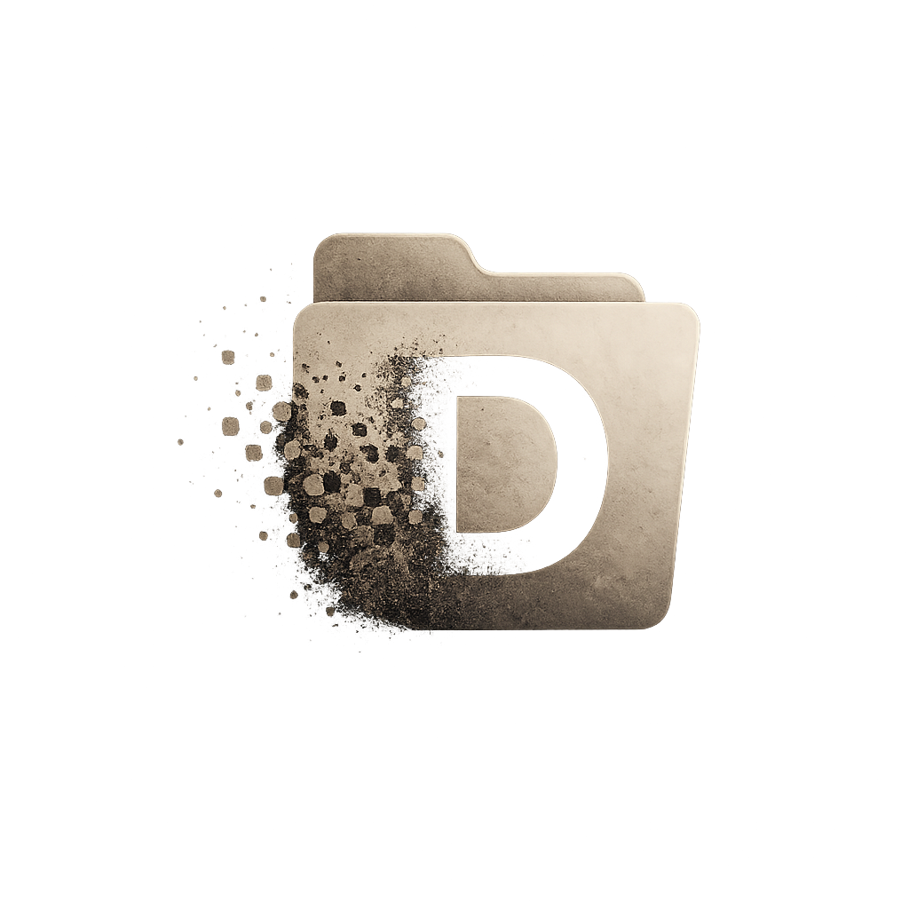
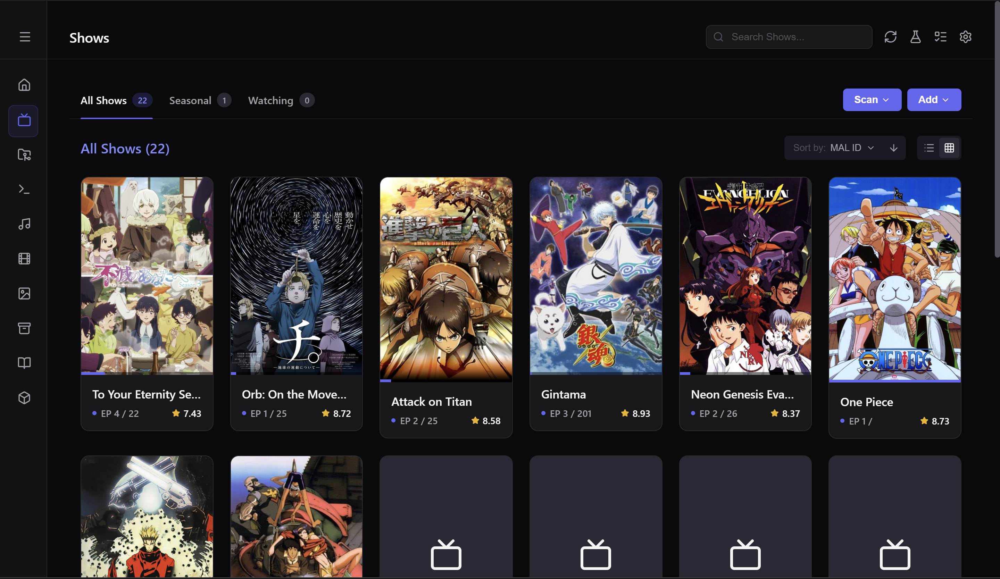
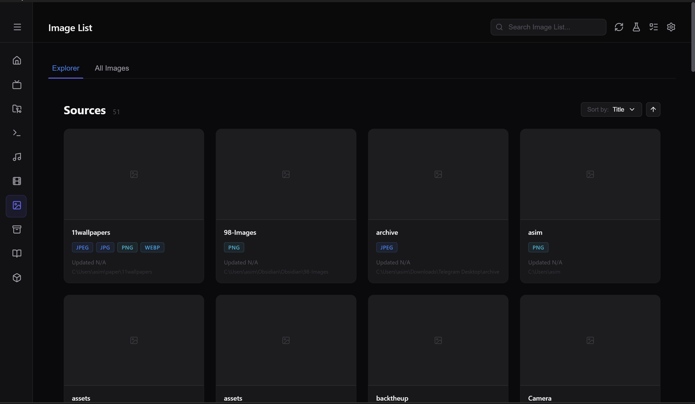
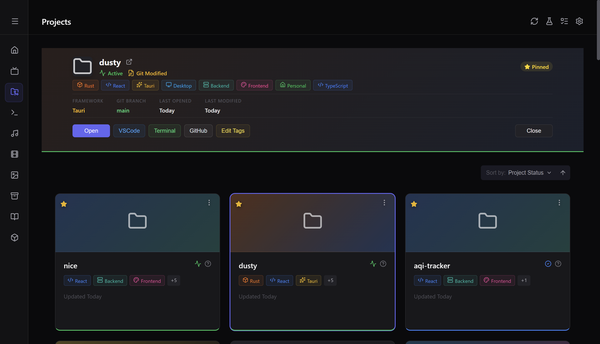
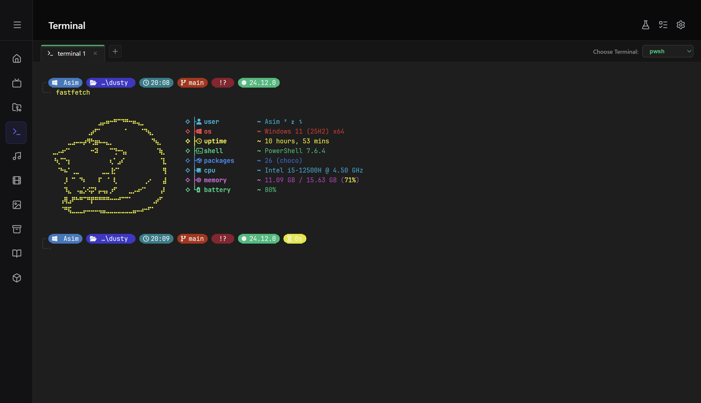
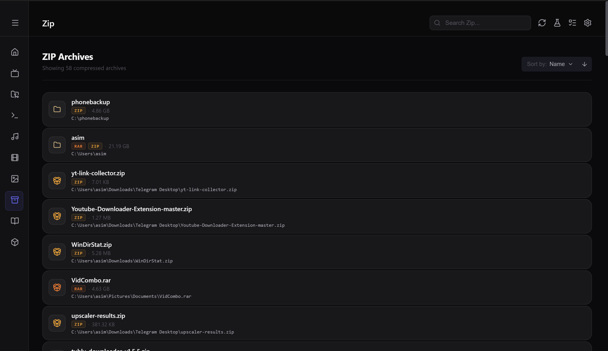
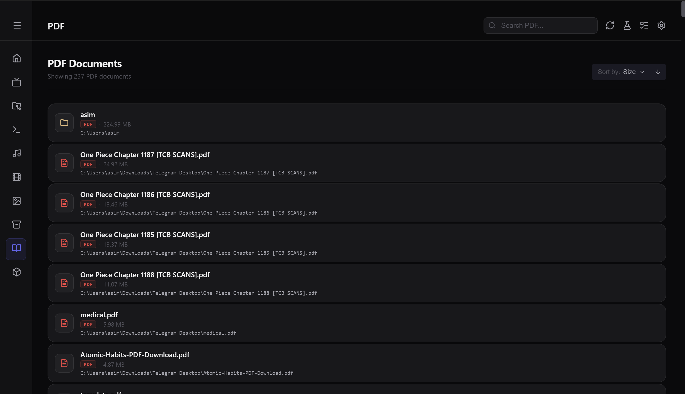
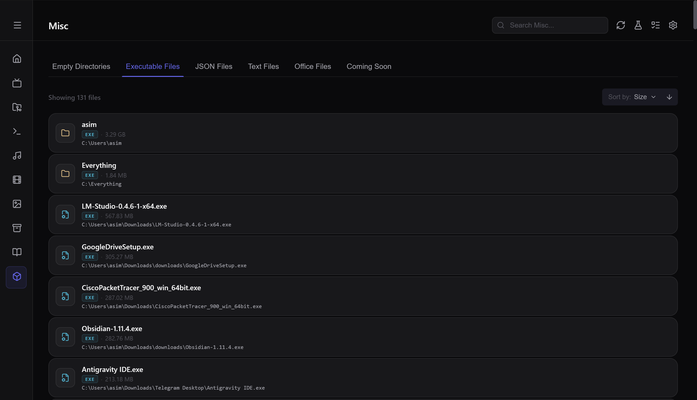

<div align="center">
  
  <h1>Dusty</h1>

  <p>
    
    
    
    
  </p>
</div>
A desktop app powered by Rust that scans your filesystem to figure out what's actually in it. It clusters TV shows scattered across random folders, finds your old projects, and surfaces files you forgot you downloaded.

**Download:** See the latest release in the [Releases](https://github.com/AsimMahata/dusty/releases) section.

I originally started building this because I kept losing track of what shows and files I already had stored somewhere on my PC. I figured it was easier to build a tool to track them down than to keep manually digging through folders.
<p align="center">
  
</p>

## ✨ Features

- **File & Media Discovery:** Finds and categorizes your **Videos, Music, Images, PDFs, ZIPs/Archives**, **MS-Office Files**, **JSON/Text Files**, and **Executables (.exe)**.
- **Show Clustering & Anime Tracking:** Groups video files into distinct TV shows **using a rolling-hash and union-find** approach. It also integrates with MyAnimeList to pull info and organize your seasonal anime.
- **Project Discovery:** Finds and lists code and work projects sitting around on your disk.
- **Storage Cleanup:** Helps free up space by identifying large archive files, image-heavy directories, and completely **empty folders**.
- **Terminal Integration:** Quickly launch your preferred system terminals directly at the path of any project or directory.
- **Desktop UI:** Uses a Rust backend and a React frontend, wired together with Tauri IPC for real-time scan results. You can open your files directly from the app.

## 📸 More Screenshots

<details>
<summary>Shows</summary>



</details>

<details>
<summary>Media</summary>



</details>

<details>
<summary>Projects</summary>



</details>

<details>
<summary>Terminal</summary>



</details>

<details>
<summary>ZIP Explorer</summary>



</details>

<details>
<summary>PDF Viewer</summary>



</details>

<details>
<summary>Misc</summary>



</details>

## 🏗️ Architecture

This is a Tauri-based application with a Rust backend and React frontend.

### Backend (Rust)

- **Filesystem Engine:** High-performance scanners for media, projects, archives, and documents.
- **Show Clustering:** Rolling-hash and union-find algorithms for grouping TV shows.
- **SQLite Caching:** Persistent scan cache for fast rescans.
- **Modular Commands:** Tauri command handlers separated by domain.

### Frontend (React)

- **Feature-Based Modules:** Each page owns its components, hooks, types, constants, and session logic.
- **Hook-Driven State:** Feature hooks manage state without global stores.
- **Three-Layer Bridge:** Ambiverts (IPC), Introverts (business logic), and Extroverts (external APIs).
- **Modern UI:** Built with React, TypeScript, and reusable components.

## 💻 Tech Stack

- Rust
- Tauri
- React (TypeScript)

## 📁 Folder Structure

```text
dusty/
├── src/                          # React + TypeScript frontend
│   ├── components/               # Reusable UI components shared across features
│   ├── constants/                # Global constants, icons, colors, and routes
│   ├── hooks/                    # Shared custom React hooks
│   ├── pages/                    # Feature modules (each page owns its components,
│   │                              hooks, types, styles, constants, and session logic)
│   ├── personalities/            # Communication layer
│   │   ├── ambiverts/            # Raw Tauri IPC wrappers
│   │   ├── introverts/           # Frontend business logic & caching
│   │   └── extroverts/           # External API clients
│   ├── providers/                # Global React providers
│   ├── types/                    # Shared TypeScript types
│   └── utility/                  # Pure utility/helper functions
│
├── src-tauri/                    # Rust + Tauri backend
│   └── src/dusty/
│       ├── api/                  # Tauri command handlers
│       ├── cache/                # SQLite-based persistent caches
│       ├── database/             # Database initialization and access
│       ├── engine/               # Core business logic
│       ├── scanners/             # Filesystem, media, and project scanners
│       ├── models/               # Domain models
│       └── utility/              # Shared Rust utilities
│
└── public/                       # Static assets (icons, images, etc.)
```

## 🛠️ Installation & Setup

You'll need a few things installed before you can run or build the app:

- [Rust](https://www.rust-lang.org/tools/install) (1.70+)
- [Node.js](https://nodejs.org/) (v16+)
- Tauri's OS-specific build tools — check their [prerequisites guide](https://tauri.app/v1/guides/getting-started/prerequisites) for details. If you're on Windows, you'll need the MSVC build tools.

### 🏃 Running locally

To spin up the development environment:

```bash
git clone https://github.com/AsimMahata/dusty.git
cd dusty/dusty-gui
npm install
npm run tauri dev
```

*Note: You don't need to manually run `cargo build` or `cargo run`. The `tauri dev` command automatically compiles the Rust backend and starts the React development server for you.*

### 📦 Building a release binary

When you're ready to build a standalone executable:

```bash
npm run tauri build
```

You can find the output binary in `dusty-gui/src-tauri/target/release/`.

## 📄 License

MIT
