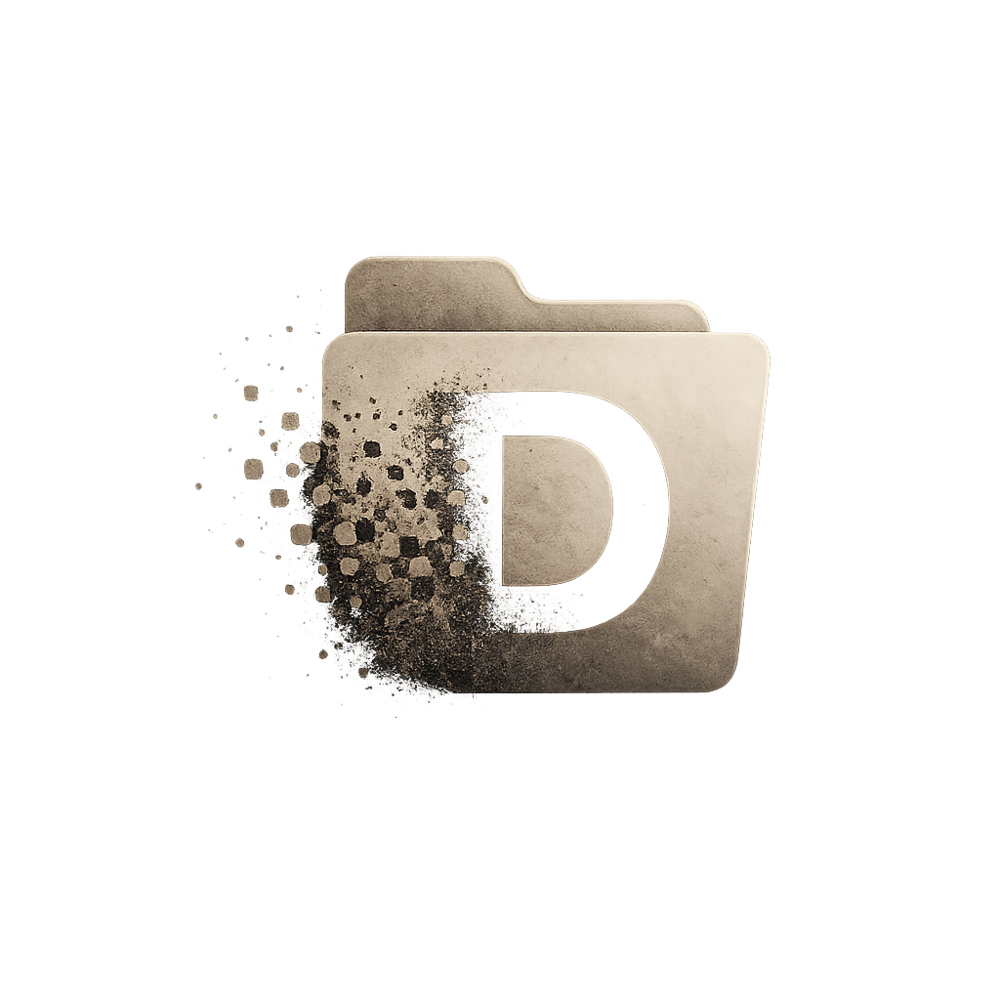
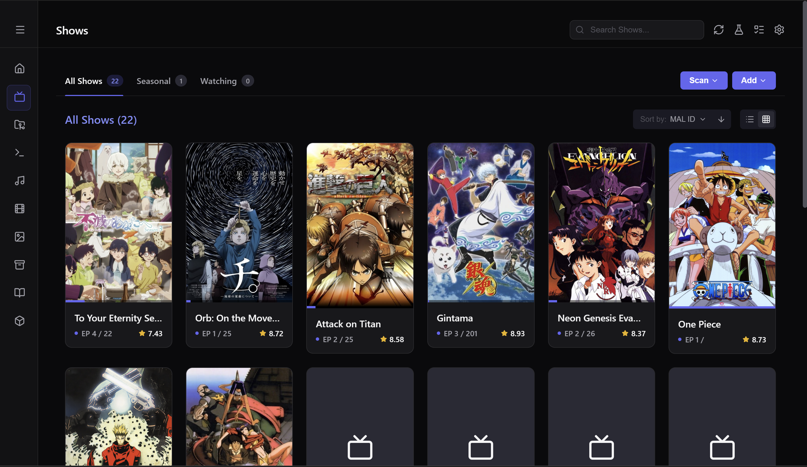
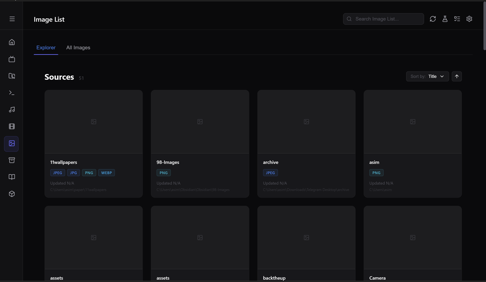
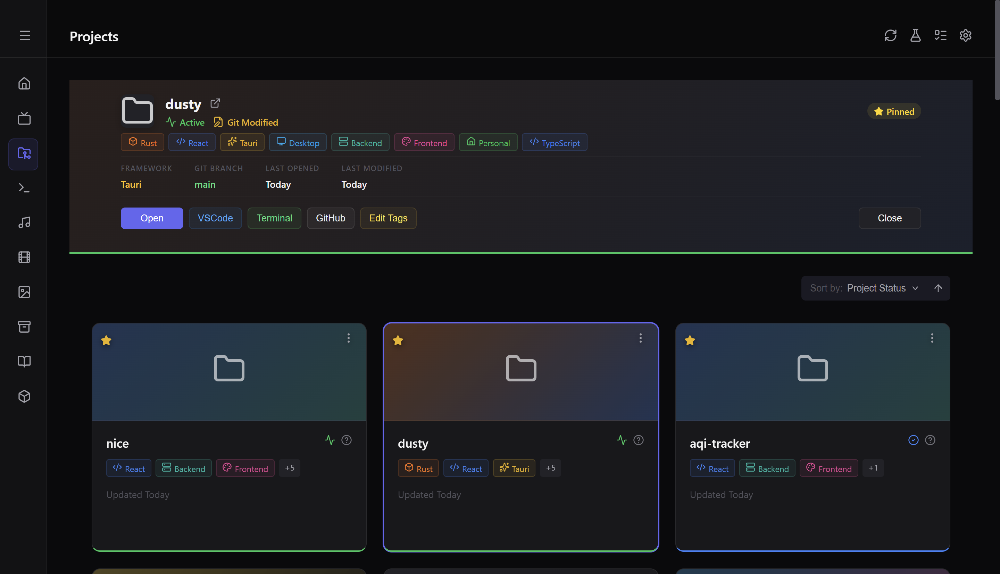
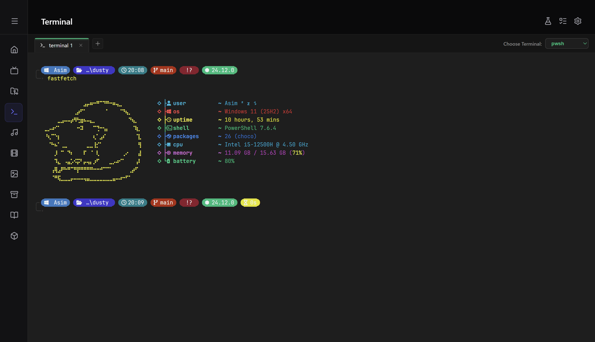
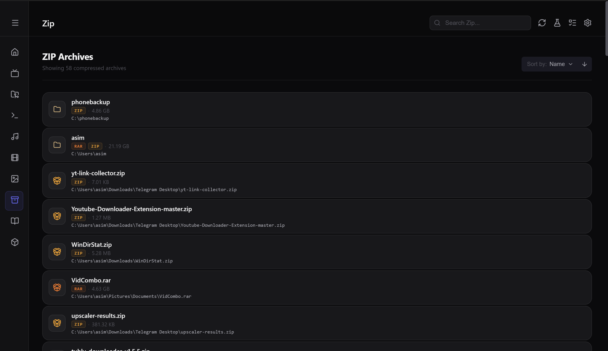
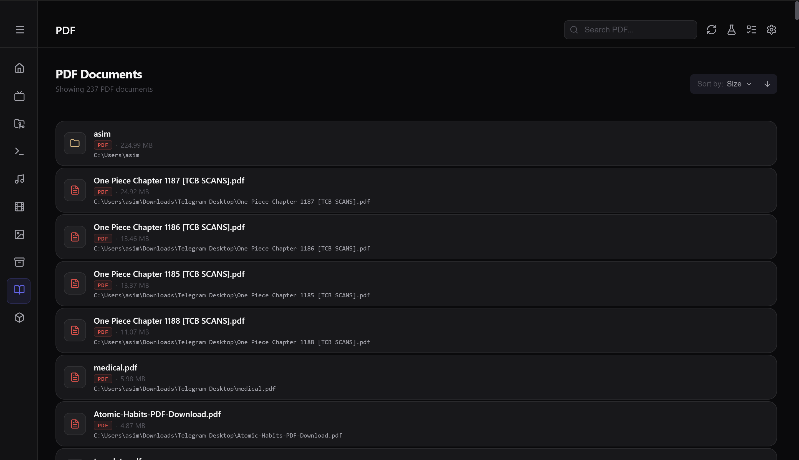
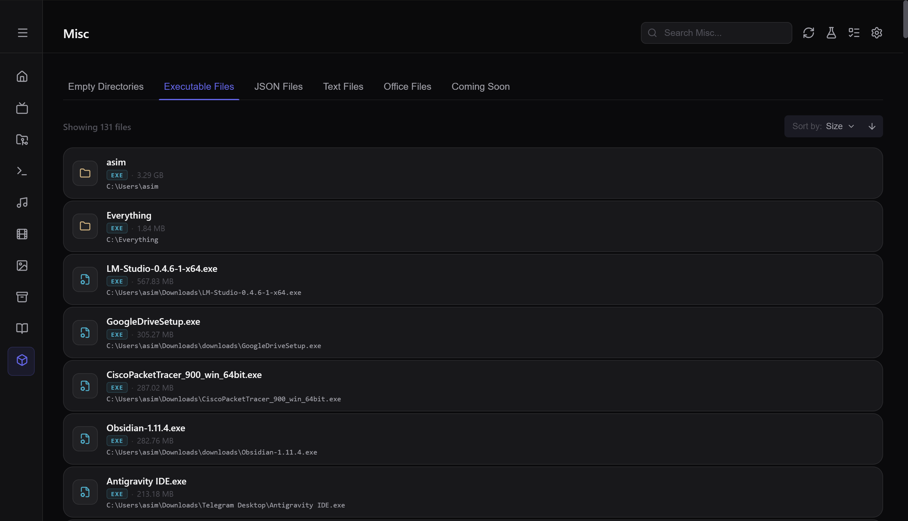
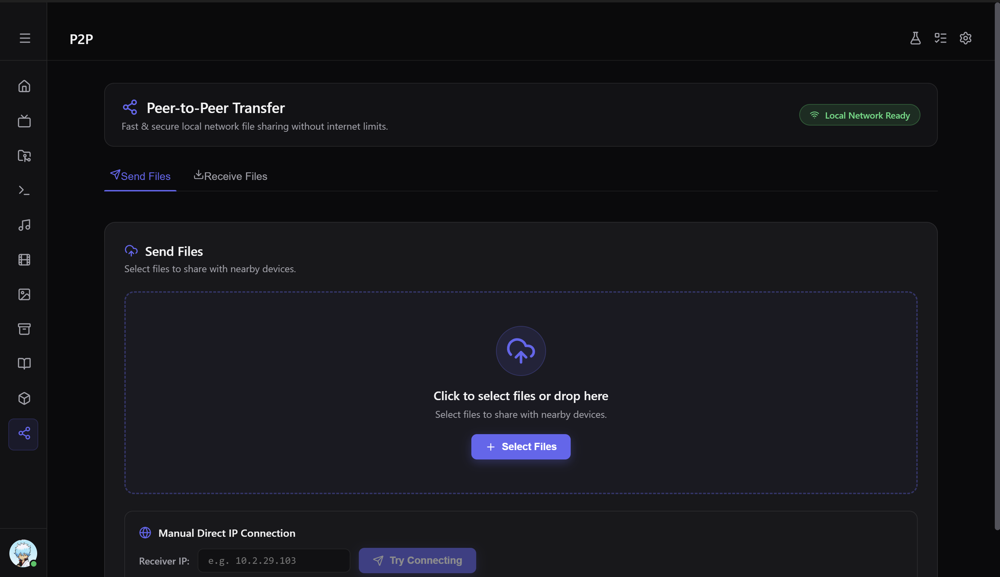
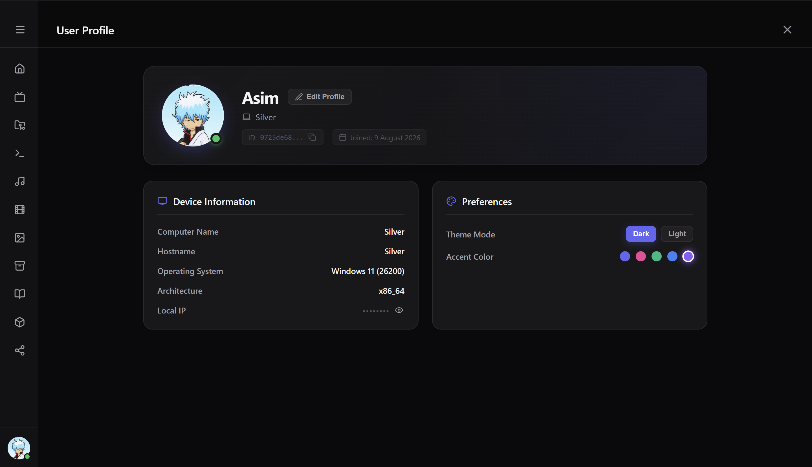

<div align="center">
  
  <h1>Dusty</h1>

  <p>
    
    
    
    
  </p>
</div>

Dusty is a desktop app built with Rust and React that helps you discover and organize the files, media, shows, anime, and projects on your system. It also lets you share files directly with other Dusty devices over your local network using P2P.

**Download:** See the latest release in the [Releases](https://github.com/AsimMahata/dusty/releases) section.

> **Note:** I originally started building Dusty because I kept losing track of what shows and files I already had stored somewhere on my PC. I figured it was easier to build a tool to track them down than to keep manually digging through folders. Over time, Dusty grew beyond that original idea into a broader tool for managing files, media, shows, and projects.

<p align="center">
  
</p>

## ✨ Features

- **File & Media Discovery:** Finds and categorizes your **Videos, Music, Images, PDFs, ZIPs/Archives**, **MS-Office Files**, **JSON/Text Files**, and **Executables (.exe)**.
- **Show Clustering & Anime Tracking:** Groups video files into distinct TV shows **using a rolling-hash and union-find** approach. It also integrates with MyAnimeList to pull info and organize your seasonal anime.
- **Project Discovery:** Finds and lists code and work projects sitting around on your disk.
- **Storage Cleanup:** Helps free up space by identifying large archive files, image-heavy directories, and completely **empty folders**.
- **Terminal Integration:** Quickly launch your preferred system terminals directly at the path of any project or directory.
- **Desktop UI:** Uses a Rust backend and a React frontend, wired together with Tauri IPC for real-time scan results. You can open your files directly from the app.
- **Multithreading & Background Workers:** Uses multithreading and background workers for heavy operations that can run independently without blocking the main thread.
- **P2P & Local File Sharing:** Sends files directly to other Dusty devices over your local network. Files can be added to a sending stash and transferred over TCP with transfer progress and speed tracking. Supports both automatic local network discovery and direct IP connections.

## 🔄 Local P2P Sharing

Dusty includes a peer-to-peer file sharing feature built for local networks:

1. **Stash Files:** Add files to your sending stash.
2. **Automatic Peer Discovery:** Devices running Dusty on the same local network discover each other automatically using mDNS.
3. **Send & Receive:** Select a target peer and send a transfer request. The receiver can accept or reject the incoming transfer.
4. **Direct IP Connection:** If automatic discovery doesn't find a peer, use the manual connection flow:
   - Receiver starts **Manual Receive**.
   - Dusty displays the receiver's local IP address.
   - Receiver provides the IP to the sender.
   - Sender enters the IP and connects directly over the local network.

## 📸 Screenshots

<details>
<summary>Shows</summary>



</details>

<details>
<summary>Media</summary>



</details>

<details>
<summary>Projects</summary>



</details>

<details>
<summary>Terminal</summary>



</details>

<details>
<summary>ZIP Explorer</summary>



</details>

<details>
<summary>PDF Viewer</summary>



</details>

<details>
<summary>Misc</summary>



</details>

<details>
<summary>P2P Sharing</summary>



</details>

<details>
<summary>User Profile</summary>



</details>

## 🏗️ Architecture

Dusty is a Tauri-based application built with a Rust backend and a React frontend.

### Backend (Rust)

- **Filesystem Engine & Scanners:** Scans and categorizes media, projects, archives, and documents.
- **P2P & Network Engine:** Uses mDNS to discover devices on the local network and TCP connections to transfer files between them.
- **Multithreading & Background Workers:** Uses dedicated workers for database operations, background tasks, and P2P operations, along with thread pools for parallel workloads. This keeps heavier operations from blocking the UI.
- **Show Clustering:** Uses rolling-hash and union-find algorithms to group video files belonging to the same TV show.
- **SQLite Database & Storage:** Uses SQLite and persistent local storage for scan results, cached information, configuration, and other application data.
- **Logging System:** Application logging powered by `tauri-plugin-log`.

### Frontend (React)

- **Feature-Based Modules:** Each page owns its components, hooks, types, constants, and session logic.
- **Hook-Driven State:** Feature hooks manage state without global stores.
- **Three-Layer Architecture:** **Ambiverts** handle Tauri IPC, **Introverts** handle frontend business logic, and **Extroverts** handle external API integrations such as TMDB and MyAnimeList.
- **Backend Integration:** Frontend code communicates with the Rust backend through Tauri commands.
- **Modern UI:** Built with React, TypeScript, and reusable components.

## 💻 Tech Stack

- Rust
- Tauri v2
- React (TypeScript)
- Vite
- SQLite

## 📁 Folder Structure

```text
dusty/
├── .env.example                  # Environment configuration template
├── public/                       # Static web assets and icons
├── screenshots/                  # Documentation screenshots
├── src/                          # React + TypeScript frontend
│   ├── components/               # Reusable UI components
│   ├── constants/                # Constants, icons, and routes
│   ├── hooks/                    # Custom React hooks
│   ├── pages/                    # Feature modules and pages
│   ├── personalities/            # Frontend communication and API layers
│   │   ├── ambiverts/            # Tauri IPC wrappers
│   │   ├── introverts/           # Frontend business logic
│   │   └── extroverts/           # External API integrations
│   ├── types/                    # Shared TypeScript types
│   └── utility/                  # Utility functions
│
└── src-tauri/                    # Rust + Tauri backend
    └── src/dusty/
        ├── api/                  # Tauri command handlers
        ├── db/                   # Database access
        ├── engine/               # Core business logic
        ├── filesystem/           # Filesystem operations
        ├── logger/               # Logging
        ├── models/               # Data structures and domain models
        ├── multithreading/       # Workers and thread pools
        ├── p2p/                  # P2P discovery, connections, and transfers
        ├── scanners/             # Filesystem and media scanners
        ├── system/               # OS integration
        └── utility/              # Rust utility functions
```

## 🛠️ Installation & Setup

### Prerequisites

- [Rust](https://www.rust-lang.org/tools/install) (1.77+)
- [Node.js](https://nodejs.org/) (v18+)
- Tauri OS prerequisites (on Windows, Microsoft Visual C++ Build Tools are required).

### 🏃 Running locally

1. Clone the repository and navigate into the project root:

   ```bash
   git clone https://github.com/AsimMahata/dusty.git
   cd dusty
   ```

2. Install frontend dependencies:

   ```bash
   npm install
   ```

3. Set up environment variables:

   Copy `.env.example` to `.env`:

   ```bash
   cp .env.example .env
   ```

   Configure `VITE_TMDB_API_KEY` in `.env` if you wish to enable TMDB show metadata lookup.

4. Start the development app:

   ```bash
   npm run dev
   ```

   *(Note: You can also use `npx tauri dev` to compile the backend and start the dev server).*

### 📦 Building a release binary

To build a standalone executable:

```bash
npm run build
```

The compiled release binary will be generated in `src-tauri/target/release/`.

## 📄 License

Dusty is licensed under the MIT License. See the [LICENSE](LICENSE) for more details.
